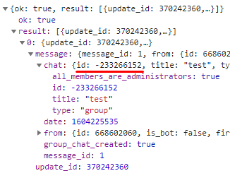

# tg-gmail-bridge

This script pulls all new emails since it was last run, filters them and sends a message containing their subjects and senders to a Telegram chat.
All configuration params are stored in the `config.json` file.
It should be scheduled to be executed every hour/15 mins/whatever.

# Configuration HOWTO

## 0. Python

Nothing special, uses Python 3. Download all dependencies using: `pip install -r requirements.txt`.
Rename `config.json.example` to `config.json`

## 1. Gmail setup

### API creds
In order to work this script requires API creds with the following scopes: 
* https://www.googleapis.com/auth/gmail.readonly
* https://www.googleapis.com/auth/gmail.labels    // Optional, might be used in the future

Generate them from the Google API Console.

### OAuth token
Just run `create_token.py` and select the target gsuite account. It should (hopefully) generate token.pickle file by itself.

### Threads query
By default the script grabs up to 100 (`config.chatId`) threads with `after: {lastRun}` query. If you want to change it, add your custom parameters to the `config.threadQuery`.

## 2. Telegram setup
### Bot token
Please ask @Mily or generate it from the @BotFather. I should be stored in the `bot.token` file.

### Getting chat id
Target chat id to which messages are sent is stored in the bot's config (`config.chatId`).

Call `https://api.telegram.org/bot<insert bot.token here>/getUpdates`.
It will output all recent actions including adding bot to the chat.

The resulting JSON will contain chat id:

**Chat ID number might change in the future (eg. group can be migrated to supergroup)!**

## 3. Run

Idk how you want to do that, just use something and execute `python3 job.py`
